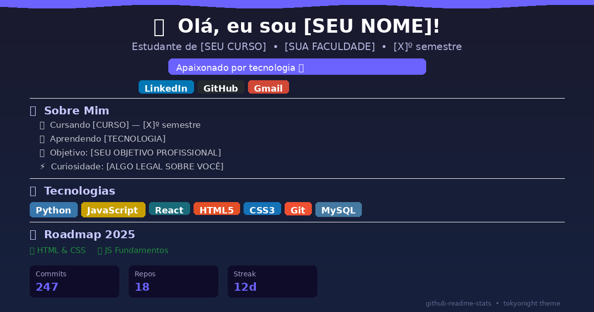
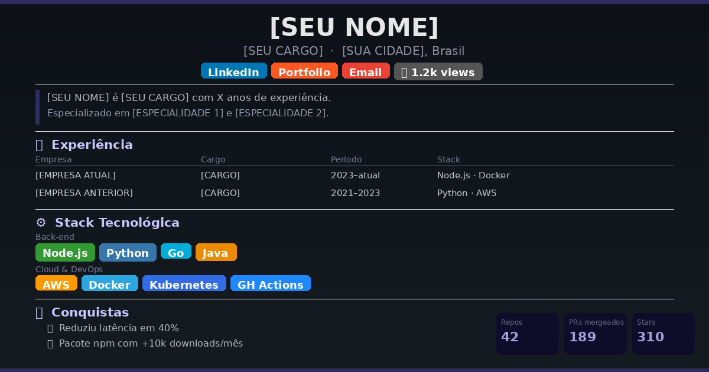
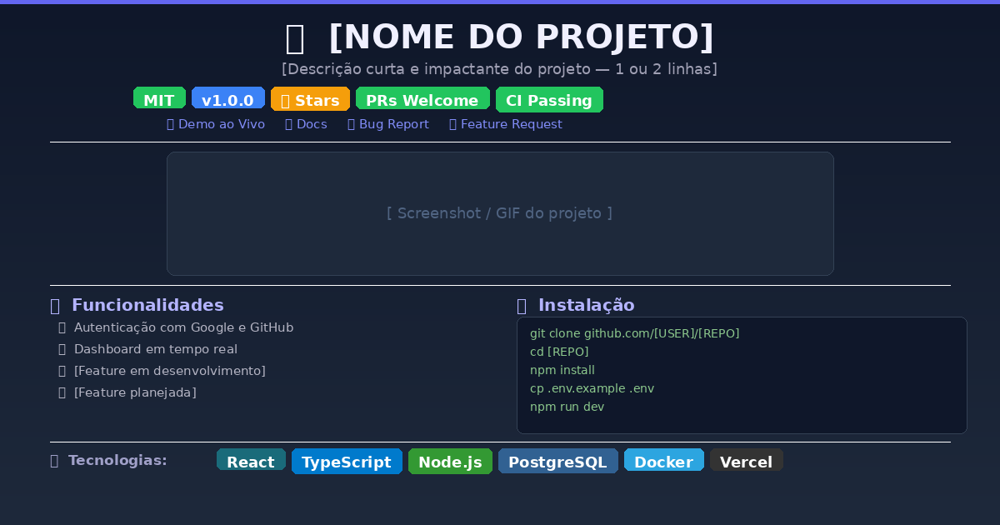
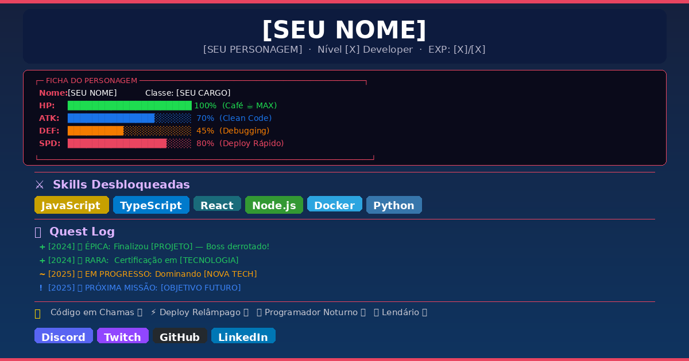
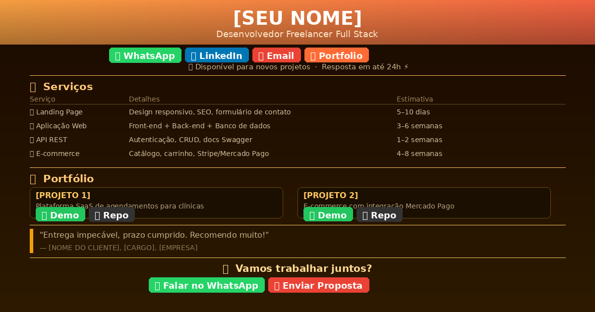

<div align="center">


[](https://github.com/[SEU-USUARIO]/[REPO]/stargazers)
[](https://github.com/[SEU-USUARIO]/[REPO]/network/members)
[](LICENSE)
[](CONTRIBUTING.md)

**Coleção de templates de README.md para GitHub — perfis e projetos.**  
Copie, personalize e surpreenda quem visitar o seu perfil. 🚀

</div>

---

## 📋 Índice

- [Modelos Disponíveis](#-modelos-disponíveis)
- [Pré-visualização](#-pré-visualização)
- [Como Usar](#-como-usar)
- [Estrutura do Repositório](#-estrutura-do-repositório)
- [Recursos Utilizados](#-recursos-utilizados)
- [Como Contribuir](#-como-contribuir)
- [Licença](#-licença)

---

## 📂 Modelos Disponíveis

| # | Template | Ideal Para | Link |
|:---:|:---|:---|:---:|
| 01 | 🎓 **Estudante de TI** | Faculdade, cursos e projetos de aprendizado | [Ver código](./templates/estudante.md) |
| 02 | 💼 **Profissional Clean** | Stack, experiência e métricas de carreira | [Ver código](./templates/profissional.md) |
| 03 | 🚀 **Documentação de App** | READMEs de repositórios e projetos | [Ver código](./templates/projeto-app.md) |
| 04 | 🎮 **Estilo Gamer / Anime** | Visual criativo, dinâmico e descontraído | [Ver código](./templates/game-style.md) |
| 05 | 🧑‍💻 **Freelancer** | Portfólio, serviços e botões de contato direto | [Ver código](./templates/freelancer.md) |

---

## 👀 Pré-visualização

<div align="center">







</div>

---

## 🛠️ Como Usar

### Opção 1 — Perfil do GitHub (repositório `[seu-usuario]/[seu-usuario]`)

1. Acesse o template desejado na tabela acima
2. Copie todo o conteúdo do arquivo `.md`
3. No seu repositório de perfil, edite o `README.md` e cole
4. Substitua todos os placeholders `[ENTRE COLCHETES]` com suas informações
5. Faça commit e veja o resultado no seu perfil 🎉

### Opção 2 — Projeto / Repositório

1. Copie o template **Documentação de App** (`./templates/projeto-app.md`)
2. Cole como `README.md` na raiz do seu projeto
3. Preencha as seções de instalação, tecnologias e funcionalidades

---

## 📁 Estrutura do Repositório

```
📦 readme-templates/
 ┣ 📂 templates/
 ┃ ┣ 📄 estudante.md
 ┃ ┣ 📄 profissional.md
 ┃ ┣ 📄 projeto-app.md
 ┃ ┣ 📄 game-style.md
 ┃ ┗ 📄 freelancer.md
 ┣ 📂 imagens/
 ┃ ┗ 🖼️ *.png
 ┗ 📄 README.md
```

---

## ✨ Recursos Utilizados nos Templates

| Recurso | O que faz | Link |
|:---|:---|:---:|
| **Capsule Render** | Banners e cabeçalhos animados | [Acessar](https://github.com/kyechan99/capsule-render) |
| **Shields.io** | Badges personalizados | [Acessar](https://shields.io) |
| **GitHub Readme Stats** | Cards de estatísticas do GitHub | [Acessar](https://github.com/anuraghazra/github-readme-stats) |
| **Readme Typing SVG** | Texto animado com efeito digitação | [Acessar](https://github.com/DenverCoder1/readme-typing-svg) |
| **Streak Stats** | Card de sequência de commits | [Acessar](https://streak-stats.demolab.com) |
| **Contrib.rocks** | Imagem de contribuidores do repo | [Acessar](https://contrib.rocks) |

---

## 🤝 Como Contribuir

Tem um template novo ou melhorias para sugerir? Contribuições são bem-vindas!

1. 🍴 Faça um **Fork** do repositório
2. 🔀 Crie uma branch: `git checkout -b template/meu-novo-template`
3. 💾 Adicione seu template em `/templates/` e faça commit
4. 📤 Push: `git push origin template/meu-novo-template`
5. 🔁 Abra um **Pull Request** descrevendo o novo modelo

---

## 📄 Licença

Distribuído sob a licença **MIT**. Use, modifique e compartilhe à vontade.  
Veja [LICENSE](LICENSE) para mais detalhes.

---

<div align="center">

Feito com ❤️ por **[Igor2920](https://github.com/igor2920)**

⭐ Se te ajudou, deixa uma estrela — isso faz diferença!


</div>